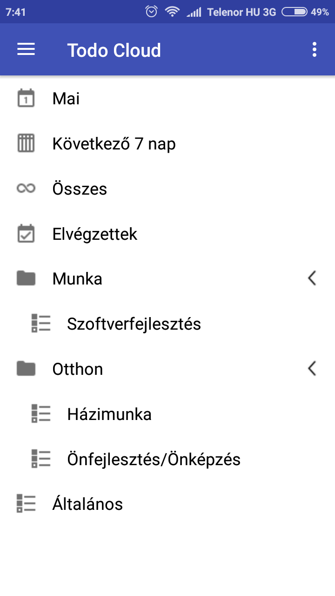

# Todo Cloud
> Manage your to do in a complex way

Todo Cloud is an advanced to do list application inspired by Wunderlist.

The project's purpose is to gain experience in the android application 
development, improve coding style, practice clean code and version control.

## Author

Roland Vitéz - LinkedIn [@roland-vitéz](https://www.linkedin.com/in/roland-vitéz/) - vitezroland91@gmail.com
